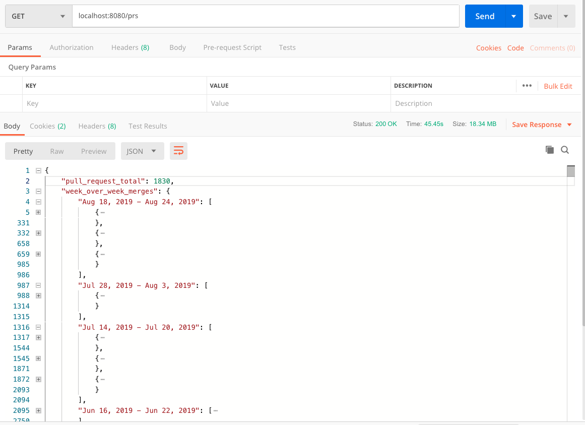

# Analyzing GitHub Pull requests for an organization
A simple node application that interacts with the GitHub Rest API. It retrieves all the Pull requests from 
all the repositories for a particular organization (specified in the .env file). Then groups the PR's into
week over week merges etc.  

# Getting started
- Clone the repository
```
git clone git@github.com:Perry5/redox-task.git
```
- Install dependencies
```
cd redox-task
npm install
```
- Set environment (vars):
```
cp .env.example .env
```
- Run the project
```
npm start
```
- Using Curl, Postman or your favorite tool, make a GET request to: 
```
localhost:8080/prs
```
make sure you watch the sever logs 

## HTTP Response
Request made using Postman


### Environment Variables
##### `GITHUB_BASE_URL` Default: `https://api.github.com/`
- Default URL for the GitHub REST API v3

##### `ORGANIZATION` Default: `ramda`
- GitHub Organization to query

##### `PER_PAGE_LIMIT` Default: `30`
- Requests that return multiple items will be paginated to 30 items by default.
We can set a custom page size up to 100. 

- NOTE: If you enter any value < 30 it will default to 30 (min) and if you enter any value > 100 it will default to 100 (max)

Higher per-page limits seem to run a bit faster. On my machine:
-  `PER_PAGE_LIMIT = 30` - Takes an average of *54* seconds to retrieve all the PRs from all the repos
- `PER_PAGE_LIMIT = 100` - Takes an average of *44* seconds to retrieve all the PRs from all the repos

##### `CLIENT_SECRET`
##### `CLIENT_ID`
- Registered GitHub application Client Secret and ID used in this case to increasing the unauthenticated rate limit.
If specified, it allows requests up to 5000 per hour. If not specified, requests are limited to 60 per hour. 


### Total # of pull requests retrieved: 1830

# Logging
Simple console.log() is used for displaying output on the server. In order to get a sense of what is happening with the server, we log some outputs to the console.
In a real environment, a logging tool like winston will be used.
