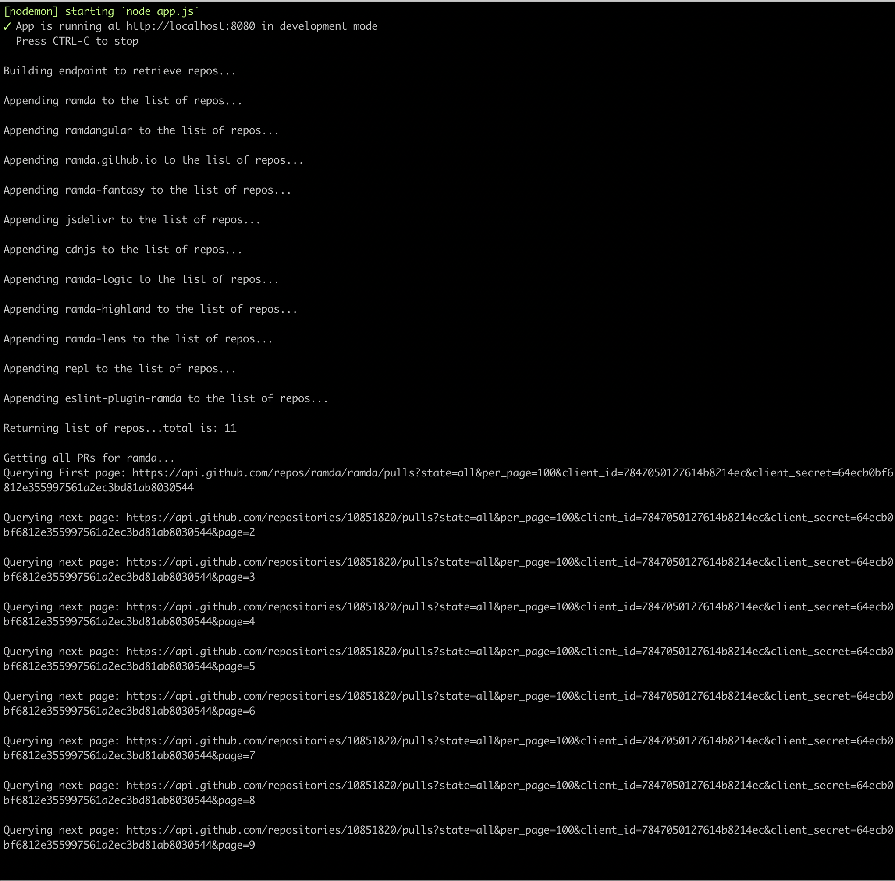

# Redox Coding Task

# Getting started
- Clone the repository
```
git clone git@github.com:Perry5/redox-task.git
```
- Install dependencies
```
cd redox-task
npm install
```
- Set environment (vars):
```
cp .env.example .env
```
- Run the project
```
npm start
```
- Using Curl, Postman or your favorite tool, make a GET request to: 
```
localhost:8080/prs
```
make sure you watch the sever logs 

### Environment Variables
##### `GITHUB_BASE_URL` Default: `https://api.github.com/`
- Default URL for the GitHub REST API v3

##### `ORGANIZATION` Default: `ramda`
- GitHub Organization to query

##### `PER_PAGE_LIMIT` Default: `30`
- Requests that return multiple items will be paginated to 30 items by default.
We can set a custom page size up to 100. 

- NOTE: If you enter any value < 30 it will default to 30 (min) and if you enter any value > 100 it will default to 100 (max)

Higher per-page limits seem to run a bit faster. On my machine:
-  `PER_PAGE_LIMIT = 30` - Takes an average of *54* seconds to retrieve all the PRs from all the repos
- `PER_PAGE_LIMIT = 100` - Takes an average of *44* seconds to retrieve all the PRs from all the repos

##### `CLIENT_SECRET`
##### `CLIENT_ID`
- Registered GitHub application Client Secret and ID used in this case to increasing the unauthenticated rate limit.
If specified, it allows requests up to 5000 per hour. If not specified, requests are limited to 60 per hour. 


### Total # of pull requests retrieved: 1830

# Logging
Simple console.log() is used for displaying output on the server. In order to get a sense of what is happening with the server, we log some outputs to the console.
In a real environment, a logging tool like winston will be used.



# Task
For the coding task, we'll build a tool to analyze pull request traffic for a Github organization.

For the part you do on your own: write some code that will retrieve all pull requests for the Ramda organization using the Github web API and store the results in memory. When we pair, we will use this collection of pull requests to answer questions like "how many pull requests were merged week over week across the organization?" (as a simple example).

Do not use a pre-existing Github library. We want to see you interact directly with the Github API. Other than that, use whatever tools (language, frameworks, etc) you like, structure your code however you like, etc. We care much more about how you solve technical problems generally than any specific knowledge and we want to see you at your best.

### Here are some resources: 
- Ramda organization: https://github.com/ramda
- Github API docs: https://developer.github.com/v3/  
- If you want, feel free to use the new GraphQL API instead of the v3 REST API: https://developer.github.com/v4/  

Please complete the task by one week from today (though let us know now if you'll need more time and it's likely we can accommodate you!). 

When you complete the take-home task, please:
- Let us know how many pull requests your project retrieves
- Push your project to your Github account and send us a link to the repo - or if you'd rather not have it on your Github account, a link to Dropbox or an emailed zip file is fine, too
- If you use a framework that generates boilerplate code, let us know which parts of the project to focus on

Once we get a chance to review the project, we will be in touch about next steps. If you have any questions, please let me know and good luck!
